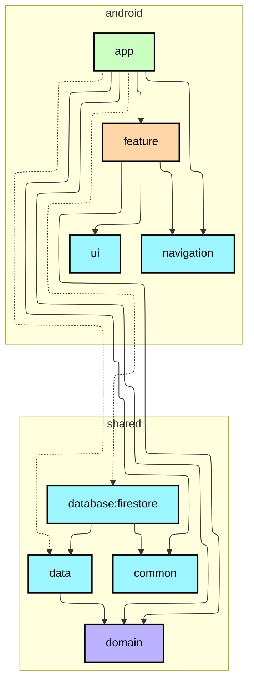

# 📍 Smopin

## 概要

喫煙者のモラルとマナーの向上を目的とした、喫煙者と非喫煙者のための喫煙所マップ

## 機能要件

### コア機能

- 地図上にピンが表示され、直感的に喫煙所を見つけられる
- Google Maps や Apple のマップにシームレスに接続され、現在地からの経路を簡単に確認できる

### MVP 以降

- 喫煙所の利用可能時間を確認できる
- マップに表示されていない喫煙所を登録・公開できる
- 喫煙所の口コミを投稿・確認できる

## 技術要件

- Android アプリ、iOS アプリに対応
- KMP でロジックを共通化
- Jetpack Compose, Swift UI で各 OS 向けの UI, State Holder を実装

### ライブラリ

#### KMP

- DI：[Metro](https://github.com/ZacSweers/metro)
- Firebase SDK：[Firebase Kotlin SDK](https://github.com/GitLiveApp/firebase-kotlin-sdk)

#### Android

- 画面遷移：[Navigation 3](https://developer.android.com/jetpack/androidx/releases/navigation3)

#### iOS

TBD

### バックエンド

- MVP では Firebase を採用

### モジュール構成

