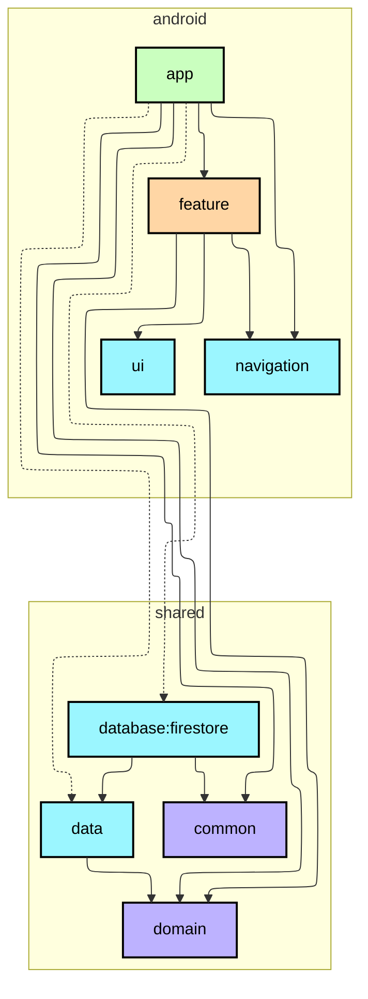

# MVP におけるモジュール、パッケージ戦略

## 目的

本ドキュメントは、開発者が本プロジェクトのモジュール、パッケージ戦略を理解し、ソースコードに反映できることを目的とする。

## 優先順位

| 観点             | 優先順位 | 理由                                                            |
|:---------------|:-----|:--------------------------------------------------------------|
| 再利用性           | ★★★  | ・AI を活用した迅速な開発の準備をするため ・本プロジェクトは習作であり、他プロジェクトにおける流用を前提とする |
| シンプルさ          | ★★☆  | 原則として、本当に必要だと判断してからモジュールを増やす                              |
| その他マルチモジュールの利点 | ★☆☆  | 主に拡張性、テスト容易性、ビルド速度の向上を実現する                                    |

### 依存性逆転

本プロジェクトでは依存性逆転を導入する。 
すなわち、[Now in Android](https://github.com/android/nowinandroid) とは異なり、データレイヤがドメインレイヤに依存する構成とする。

| 観点            | 理由                              |
|:--------------|:--------------------------------|
| ボイラープレートの増加   | AI を活用することで、コーディングコストが削減されるため   |
| 複雑性の増加・理解の難しさ | AI を活用することで、学習コストや認知コストが削減されるため |

## モジュール

### shared モジュール

| モジュール                | 説明                                                                              |
|:---------------------|:--------------------------------------------------------------------------------|
| `common`             | Kotlin 依存の汎用的なコンポーネントを格納する                                                      |
| `data`               | ・データレイヤの抽象モジュール ・Repository の実装、データモデル、DataSource のインターフェース定義を格納する          |
| `database:firestore` | ・データレイヤの具象モジュール 主に NetworkDataSource の実装を格納する ・Firebase Firestore に依存する |
| `domain`             | ・ドメインレイヤの抽象モジュール ・ドメインモデル、Repository のインターフェースを格納する                         |

### android モジュール

| モジュール     | 説明                                                         |
|:----------|:-----------------------------------------------------------|
| `app`     | アプリモジュール                                                   |
| `feature` | ・機能モジュール ・画面単位ではなく、機能単位でモジュールを分割する                     |
| `ui`      | ・UI レイヤの汎用的なコンポーネントを格納する ・共通 UI コンポーネント、カスタムテーマなどを格納する |

### ios モジュール

| モジュール         | 説明                                                                   |
|:--------------|:---------------------------------------------------------------------|
| `di`          | iOS の依存グラフを組み立てる                                                     |
| その他 iOS モジュール | ・Swift Package Manager（SPM）を使用する ・原則として、`android` モジュールと共通の構成とする |

### モジュールグラフ

## パッケージ

### shared:domain モジュール

知識単位でパッケージを切り分ける（例：smokingArea など）。 
model や repository など、責務ごとにパッケージを切らない。

### android:ui モジュール

責務単位でパッケージを切り分ける。

| パッケージ          | 説明                                                |
|:---------------|:--------------------------------------------------|
| `component`    | 共通 UI コンポーネントを格納する                                |
| `designSystem` | Color, Typography, Shape, Spacing などのカスタムテーマを格納する |

## MVP で採用しないコンポーネント

- UseCase（TBD）
- インメモリキャッシュ（CacheDataSource）

## 参考資料

- [Guide to Android app modularization | App architecture | Android Developers](https://developer.android.com/topic/modularization)
- [android/nowinandroid](https://github.com/android/nowinandroid)
- [Guide to app architecture | App architecture | Android Developers](https://developer.android.com/topic/architecture)
